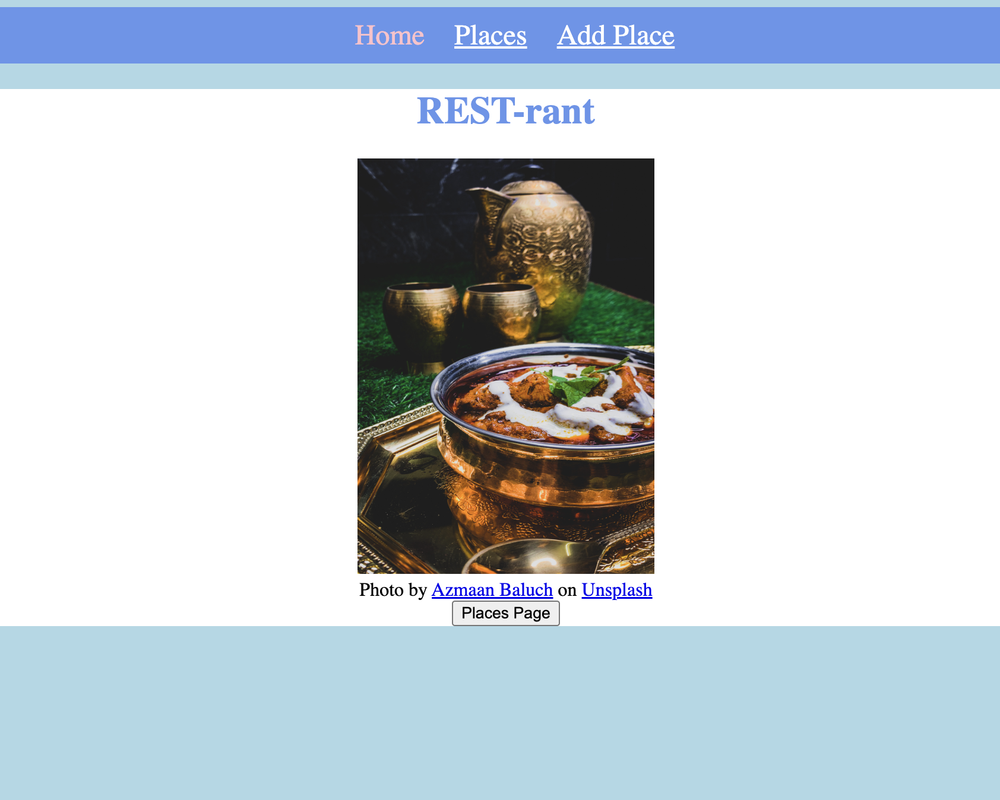
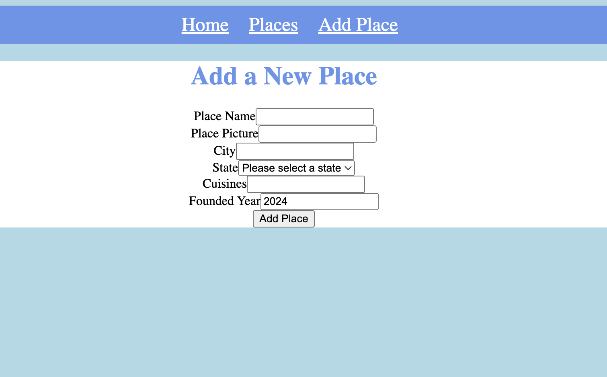

# Project REST-Rant

REST-Rant is an app where users can
1. write reviews on restaurants/eating establishments
2. rate them on our scale of 1-5
3. search restaurants by categories of 
    date night
    brunch 
    pet friendly
    family friendly
    group friendly
    cocktail/dive bars
    waterside
    fine dining

# DEMO

## Tech Stack

### Frontend

- **Framework:** React.js
- **Styling:** CSS-in-JS with Styled Components
- **Routing:** React Router

### Backend

- **Framework:** Express.js
- **Database:** MongoDB

 ### API
----------------------------------------------------------------------------
Method   |      Path              | Purpose
GET      |            /           |  Home Page
GET      |        /places         |  Places index page
POST     |        /places         |  Create new place
GET      |       /places/new      |  Form page for creating a new place
GET      |      /places/:id       |  Details about a particular place
PUT      |      /places/:id       |  Update a particular place
GET      |     /places/:id/edit   |  Form page for editing an existing place
DELETE   |   /places/:id          |  Delete a particular place
POST     |/places/:id/rant        |  Create a rant (comment) about a particular place
DELETE   |/places/:id/rant/:rantId|  Delete a rant (comment) about a particular place
GET      |            *           |  404 page (matches any route not defined above)

------------------------------------------------------------------------------
### App (http://localhost:3000)
| Path                  | Component                 | Purpose                                                                         |
| --------------------- | ------------------------- | ------------------------------------------------------------------------------- |
| /                     | `Home.js`                 | Home page                                                                       |
| /sign-up              | `users/SignUpForm.js`     | Form for creating a new user                                                    |
| /places               | `places/PlaceIndex.js`    | List of places                                                                  |
| /places/new           | `places/NewPlaceForm.js`  | Form for creating a new place                                                   |
| /places/:placeId      | `places/PlaceDetails.js`  | Details of a place, including it's comments, and a form to create a new comment |
| /places/:placeId/edit | `places/EditPlaceForm.js` | Form for editing a place                                                        |